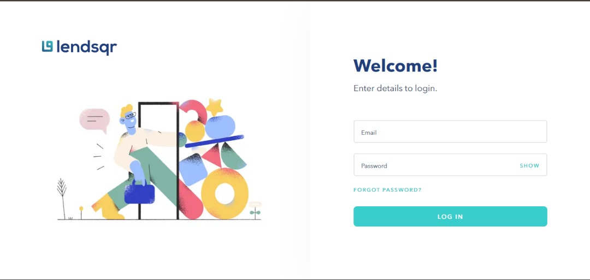
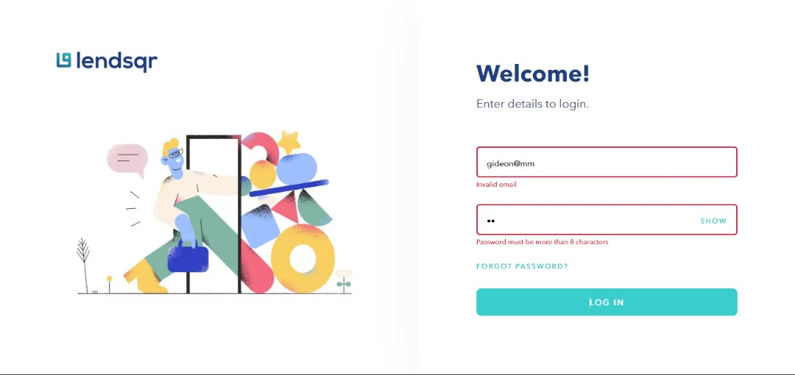
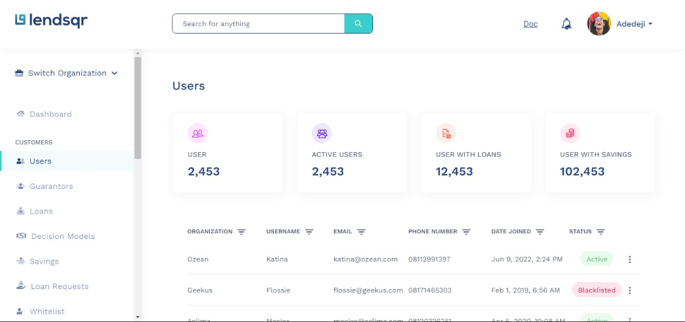
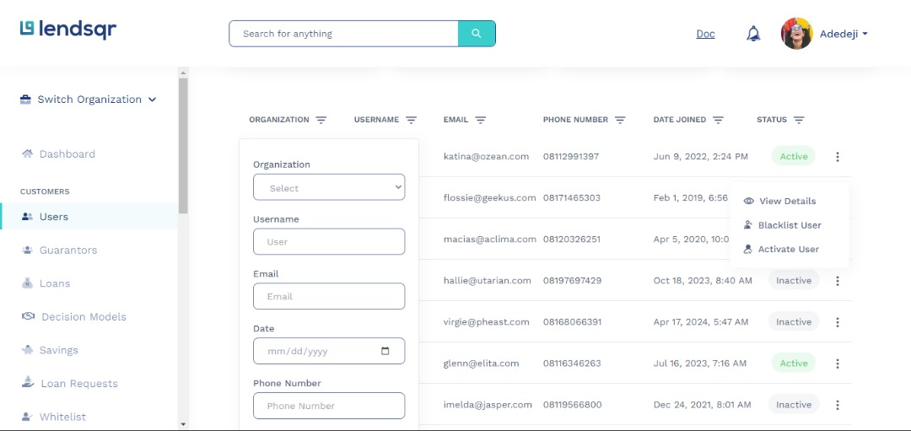
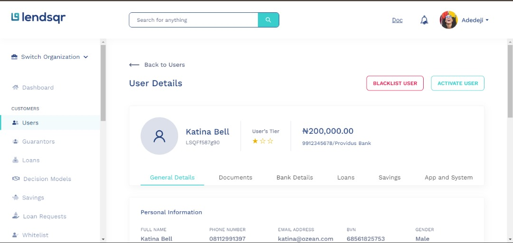

# LendSQR Frontend Test

## Technologies

- Nextjs (App Router)
- SCSS - styling
- Typescript
- Vercel (Hosting)
- Github (Version control)

## Login Credentials

- Email: gideonchidi@lendsqr.com
- Password: 3jp7P55lV+7'

## App Features

- Auth form: Added a simple email and password validation. Once validated, a cookie is created for the session and the user is redirected to the user screen
- Filter Users: Added filtering logic based on the design and stored the filter state in memory
- Pagination: Users can increase limit per page and also move to next and previous page. The page and limit are stored in the url as search params
- Route Protection: Made use of Nextjs middleware to add route protection on the app layout group (dashboard & user)

## Project Structure

- `Layout-Groups`: I divided the project into 2 layout groups: `(app)` and `(auth)`. This made it easier for me to add the `Header` and `Sidebar` components to all pages in the `(app)` layout group.
- `global.d.ts`: This is just used to store types for reusablity
- `hooks`: I used this folder to store all the custom hooks created for this project. Inside it I have the `use-validation` hook, which is use to validate input value based on a validation function passed as an arguement. I also have the `use-pagination` hook. As it name implies, all pagination logic is managed by this hook.
- `utils`: I added this folder to store all my utility functions and files. Here are some of them:

  - `styles.utils.scss`: I used this file to add all the global variables for this project. This variables store thing like colors, border-radius and so on.I also added mixins for better style reusablity
  - `validators.ts`: This is where i store all my validation functions for the email and password input in the login page.
  - `constants.ts`: As the name implies, I just used this to store constants like status, filter actions and so on

- `middleware.ts`: This is used as an interceptor. It checks if the `isLoggedin` cookie exists and base on this it eithers allows or restricts access.
- `assests`: I used this folder to add all the images and icons for this project.

## Design

### Login

### Login Error

### Users

### User (Filter and Action dropdown)

### User Detail

